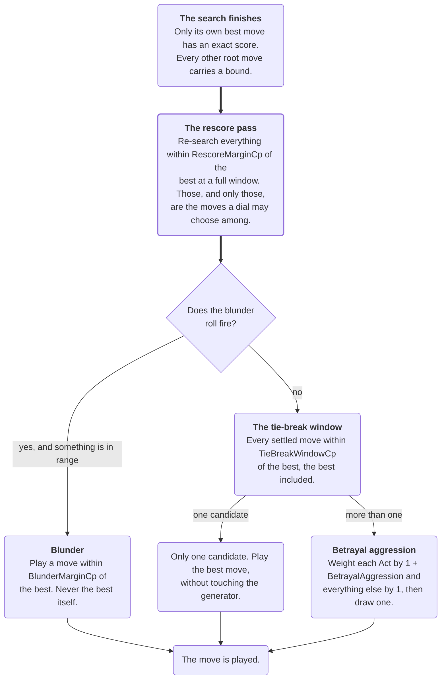

# Difficulty

How one engine becomes six opponents, what each dial does, and what has and has not been verified
about them.

Read `search.md` first. This page assumes the vocabulary it defines — root moves, the rescore pass,
soft and hard budgets — and describes only the layer sitting on top of them.

## How it works

There is one search and one evaluator. A difficulty tier is a row of data, not a subclass: the
`AIProfile` struct in `Assets/_Scripts/AI/Profiles/AIProfile.cs` holds every value that makes one
tier behave differently from another, and `AIProfileTable.cs` is where the six the game ships are
declared. Adding a seventh is adding a row.

The dials reach the game through four separate paths, and knowing which is which saves a lot of
confusion when a change does not do what you expected:

| Dial | What it touches | Applied by |
|---|---|---|
| `MaxDepth`, `TimeBudget` | the search itself | `AISearchSettings.FromProfile` |
| `BlunderRate`, `BlunderMarginCp`, `TieBreakWindowCp`, `BetrayalAggression` | which of the search's own ranked moves gets played | `MoveSelectionPolicy` |
| `AttackDefenseBias` | how the evaluator weighs its non-material terms | `EvaluationWeights.FromProfile` |
| `UseOpeningBook`, `OpeningBookDepthPlies` | how long the tier plays from memory | `OpeningBookPolicy` |

The rule the whole design hangs on is worth stating before the details:

**A dial may only choose among moves the search already generated and ranked.** Nothing here
invents a move, forces one, or edits the board. A weaker tier misses a good idea; it does not play
noise. That is the difference between an opponent a beginner can learn from and one that hangs a
queen for no reason.

## The six tiers

Read straight out of `AIProfileTable.cs`:

| Tier | Depth | Soft / hard budget | Blunder rate | Blunder margin | Tie-break window | Betrayal aggression | Attack bias | Book depth |
|---|---:|---:|---:|---:|---:|---:|---:|---:|
| easy | 3 | 400 / 1300 ms | 30% | 120 cp | 30 cp | 0 | 1.0 | 4 plies |
| normal | 5 | 700 / 2250 ms | 10% | 80 cp | 20 cp | 0 | 1.0 | 8 plies |
| hard | 8 | 900 / 3000 ms | 2% | 40 cp | 15 cp | 0 | 1.0 | 14 plies |
| aggressive | 7 | 900 / 3000 ms | 5% | 60 cp | 25 cp | 0.7 | 1.5 | 10 plies |
| extreme | 9 | 1000 / 3000 ms | 0 | 0 | 10 cp | 0.3 | 1.2 | unlimited |
| impossible | 9 | 1200 / 3000 ms | 0 | 0 | 0 | 0 | 1.0 | unlimited |

Three things about that table surprise people.

**The roster is not sorted by depth.** `aggressive` searches shallower than `hard`. It is not a rung
on the ladder — it is a sideways step, a differently-shaped opponent at roughly `hard`'s level, and
the strength gate deliberately never asserts that it beats `hard`.

**`impossible` has every dial at zero.** It is the search, unmodified. Everything above it in this
table is the search plus a handicap, which is why `impossible` is also the only tier that is
structurally deterministic — with no blunder rate and no tie-break window there is nothing to roll,
and `MoveSelectionPolicy` makes no random calls at all.

**The weaker tiers get *shorter* book allowances, not longer.** A tier is cut off from the book after
its allowance runs out even if the book still knows the position, which is what stops a
beginner-level opponent reciting eight moves of flawless theory and then hanging a piece on the
ninth. `0` means "as far as the book goes", so `extreme` and `impossible` are the two with no limit.

## What each dial does

### Depth and budgets

`MaxDepth` is a ceiling, not a promise, and `TimeBudget` decides whether the tier ever reaches it.
`easy` and `normal` are shallow by design and hit their ceiling in a fraction of their budget on a
desktop. The four deeper tiers are budget-bound: they reach whatever depth the clock allows on the
hardware in front of them. See `search.md` for what happens to the remainder of the budget once a
tier stops deepening — on a phone that remainder is most of the move.

### The order they run in

Where each selection dial runs, and in what order. `RescoreMarginCp` is the one value there that is
not a dial anybody sets — it is derived from two that are, and *Why the dials force a second search
pass* below has the formula. Two other things in that picture are easy to get backwards.

**The blunder roll short-circuits.** When it fires and finds something in range it plays that move
and returns; the tie-break window and the aggression weighting never run at all. They are not stages
a blunder passes through on its way out.

**Only settled moves are ever selectable.** That is what the box in outline is protecting. If the
search is cancelled before the rescore pass finishes, the best move can be the only one carrying an
exact score, and every branch below then collapses to playing it whatever the dials are set to.

### The blunder roll

`BlunderRate` is the probability that the tier plays something other than its own best move.
`BlunderMarginCp` bounds how much worse that move may be. The roll happens first, before any other
selection dial, and it picks uniformly among the root moves scoring within the margin of the best —
excluding the best itself, because a "blunder" that returns the best move is not one.

If nothing qualifies (a position with a single legal move, say) the roll falls through rather than
forcing a mistake that does not exist. So a 30% blunder rate does not mean 30% of `easy`'s moves are
bad; it means 30% of them are *rolled for*, and the roll finds a candidate only when the position
offers one.

### The tie-break window

`TieBreakWindowCp` is how far below the best score a move may be and still be considered a near-tie.
Every root move inside that window becomes a candidate and one is chosen at random. A window of zero
— or a position with one standout move — leaves exactly one candidate, and the code returns it
without touching the random number generator.

This is what stops a tier repeating the same game against the same opening. It is also the reason
the rescore pass exists, and that connection is the least obvious thing on this page.

### Why the dials force a second search pass

Alpha-beta proves the value of the move it settles on. Every other root move comes back as a
*bound* — "no better than X" — because the search stopped looking as soon as it knew that move could
not win. Choosing at random among bounds is choosing at random among numbers that were never
measured.

So before any dial picks, the candidates have to be re-scored properly. `RescoreMarginCp` is how
wide that pass has to look, and it is derived rather than authored:

    RescoreMarginCp = max(BlunderMarginCp, TieBreakWindowCp)

Whichever dial reaches further sets it, because the pass has to cover every candidate any dial might
pick. Zero means no dial is asking and the pass is skipped entirely — which is why `impossible` pays
nothing for machinery it does not use.

**That formula is a coupling, and it is enforced.** It once existed as nine separate copies across
the codebase. `SingleSourceOfTruthTests` now fails the build if a tenth appears, naming the file and
line, because the day two copies disagree is the day a tier randomises over numbers that were never
made exact.

### Betrayal aggression

`BetrayalAggression` reweights the candidates already inside the tie-break window, making an Act
more or less likely to be the one chosen. `aggressive` sits at 0.7 and `extreme` at 0.3; the other
four are at zero and behave as though the dial did not exist.

The constraint on it is absolute and worth quoting from the code: aggression **can bias which
in-window move gets picked, but it can never pull in a move outside the window.** The AI never
chooses a materially worse move in order to force or avoid a Betrayal. A tier that likes betraying
its own pieces likes it *among moves it was already happy to play*.

### Attack/defence bias

`AttackDefenseBias` scales the evaluator's non-material terms — above 1.0 leans toward attacking
play, below 1.0 toward defensive. The defensive side mirrors it (`DefenseScale = 2 − bias`), and the
documented range is 0.5 to 2.0. Material is never scaled, so no bias makes the AI misvalue a queen.

Only `aggressive` (1.5) and `extreme` (1.2) move it.

## The guardrail every profile must satisfy

A shallow search cannot be trusted to reweight its own evaluator. The reweighting only gets vetted by
the search that follows it, and below a certain depth there is not enough search left to catch a
reshaped evaluator walking into a bad line — which reads as an erratic opponent rather than a
characterful one.

So `AIProfileGuardrails` clamps two dials whenever `MaxDepth` is below **4**:

| Dial | Clamped to |
|---|---|
| `AttackDefenseBias` | 0.8 – 1.2 |
| `BetrayalAggression` | −0.3 – 0.3 |

This applies wherever a profile comes from — the built-in table, an authored ScriptableObject, or one
constructed by hand in a test. `easy` is the only shipped tier below the threshold, and its authored
values already sit inside the clamp, so nothing changes for it today. Give `easy` a bias of 1.5 and
you will get 1.2.

## Adding or changing a tier

1. Add a row to `AIProfileTable.cs`, or edit one. That is the only place the shipped tiers are
   declared.
2. Check the guardrail if your depth is below 4 — the clamp will quietly narrow two of your dials.
3. Run the `Slow` category. `AIProfileStrengthGateTests` is the only thing that catches a tier
   playing worse than the one below it, and it does not run in the fast half.
4. Play it. `Docs/Playtests/README.md` has the protocol, and it exists because the benchmark can
   prove a tier wins more often without telling you whether losing to it felt fair.

Step 4 is not optional politeness. Every number on this page is a measurement of *how often* a tier
wins, and none of them is a measurement of whether it is any fun.

## What is verified, and what is not

Verified automatically:

| Property | Fixture |
|---|---|
| The rescore margin is asked for, never worked out again | `SingleSourceOfTruthTests` |
| Personality never reads root scores that were never made exact | `SearchCorrectnessTests` |
| A zero-dial profile takes the search's best move with no random calls | `MoveSelectionPolicyTests` |
| The blunder roll stays within its margin and never returns the best move | `MoveSelectionPolicyTests` |
| Aggression never pulls in a move from outside the tie-break window | `MoveSelectionPolicyTests` |
| A move inside the tie-break window is reachable, and is not reachable without it | `MoveSelectionPolicyTests` |
| Aggression moves the same draw off a quiet move and onto an Act | `MoveSelectionPolicyTests` |
| A tier whose only dial is the window still reaches the selection policy | `AsyncAgentTests` |
| Bias and aggression are clamped below the depth threshold | `AIProfileGuardrailTests` |
| A tier stops consulting the book once its allowance is spent | `AsyncAgentTests` |
| Every tier arrives inside its hard budget and reaches a depth floor | `AIProfileSearchBenchmarkTests` |
| No stronger tier loses to a weaker one | `AIProfileStrengthGateTests` (`Slow`) |

The last three rows are recent, and how they came about is worth knowing.

Until they existed, the tie-break window and the Betrayal aggression weighting could each be deleted
outright with every test in the fast half still passing, and so could the clause in `AsyncAIAgent`
that decides whether a tier reaches the selection policy at all. That third one mattered most.
`extreme` is the only shipped tier with no blunder rate and a real window, so that clause was the
whole of its personality: drop it and `extreme` plays the search's plain best move for the rest of
the match, in silence.

Every assertion in place at the time was either "the result is the best move" or "the result is not
this one specific worse move" — and a dead dial returns the best move, which satisfies both. What
closed it is the shape the book allowance already used: a case and a control that differ only in the
dial, so a difference between them cannot have come from anywhere else.

What is still **not** verified is whether the six tiers feel like six different opponents. The suite
now holds the mechanism — the dials are read, they change the answer, and a real match reaches them
— but how often a tier's answer actually differs, and whether that reads as character or as noise,
is a question for `Docs/Playtests/README.md` rather than for a fixture.

## What difficulty is worth: measured

Strength ordering is the thing that is actually measured, and the receipts are in
`Docs/Benchmarks/`. `baseline.md` carries the committed tournament results; `agreement-baseline.md`
carries how often each tier agrees with a deeper reference search on a fixed set of positions.

Two results from that work are worth knowing before you tune anything.

**The ladder has inverted before, and not for the reason it looked like.** A time-budgeted tier once
lost consistently to a shallower one. Two independent causes were found within a minute of each
other: an unanswerable Betrayal Act being scored as a stalemate draw, and personality selection
randomising over alpha-beta bounds rather than exact scores. The second is why the rescore pass
exists. Neither was a dial being set wrong.

**The gap between the top two tiers is smaller than the numbers suggest, and it is accepted.**
`extreme` and `impossible` share a depth ceiling and differ only in budget and tie-break window. On a
middlegame position at three seconds the four deep tiers can all bottom out at the same depth, at
which point what separates them is their dials rather than their search. Attempts to widen that gap
were made, measured and dropped; the decision to stop is recorded rather than reopened.

Read `Docs/Benchmarks/README.md` next for how a run is produced, or `opening-book.md` for the one
dial on this page whose value has been measured directly and found to be nil.
