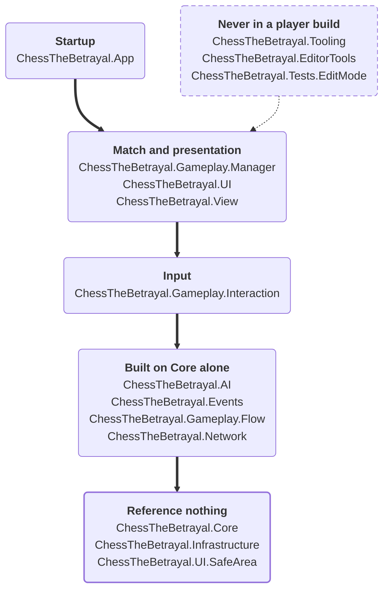

# Assemblies and layering

Which assembly does what, what each is allowed to reference, and where a new file goes.

Read this before adding a file to an unfamiliar folder, and before adding a reference to any
`.asmdef`. Both of those are checked automatically and will fail a pull request if they cross a line
this page describes.

## Why the project is split at all

Unity will happily compile every script in a project into one assembly. This one is split into
fifteen, for two reasons that are worth separating.

**The first is testability, and it is the reason the split started.** The chess rules and the search
are plain C# with no engine types in them, so they can be tested in a plain NUnit fixture with no
scene, no camera and no Play mode. That is why about 1,400 tests finish in under a minute. It is only
possible because `Core` is physically incapable of referencing UnityEngine — see below.

**The second is that a boundary a compiler enforces does not depend on anyone remembering it.** If
`Infrastructure` has no reference to `Core`, a file in `Infrastructure` that reaches for a chess rule
does not compile. Nobody has to notice it in review.

## The assemblies

| Assembly | What lives there |
|---|---|
| `ChessTheBetrayal.Core` | The chess rules: the board, move generation, legality, the Betrayal state machine, the clock's logic. No engine types at all. |
| `ChessTheBetrayal.AI` | The search, the evaluator, the opening book, difficulty profiles, device benchmarking. |
| `ChessTheBetrayal.Events` | The ScriptableObject event channels the rest of the game talks through. |
| `ChessTheBetrayal.Infrastructure` | Platform edges — files, device details, logging, sharing a report. Knows the machine, knows nothing about chess. |
| `ChessTheBetrayal.Gameplay.Flow` | Match flow: what happens between games. |
| `ChessTheBetrayal.Gameplay.Interaction` | Turning a player's input into a move the engine will accept. |
| `ChessTheBetrayal.Gameplay.Manager` | The per-match driver that owns a game in progress. |
| `ChessTheBetrayal.View` | Everything that draws the board and the pieces, and the input that hits them. |
| `ChessTheBetrayal.UI` | Menus, panels, HUD. |
| `ChessTheBetrayal.UI.SafeArea` | Keeping a layout clear of a phone's notch. Nothing else. |
| `ChessTheBetrayal.App` | Startup wiring — the composition root. |
| `ChessTheBetrayal.Network` | Multiplayer groundwork. Not implemented; see `Docs/Multiplayer/`. |
| `ChessTheBetrayal.Tooling` | Harnesses that build and measure the game: tournaments, strength runs, corpus generation. |
| `ChessTheBetrayal.EditorTools` | Editor windows and inspectors. |
| `ChessTheBetrayal.Tests.EditMode` | The suite. |

The last three never reach a player build — their `includePlatforms` is `Editor` alone, and a test
fails if that changes. Everything else restricts no platform, and a test fails if one starts to.

## What may reference what

Three assemblies reference **nothing**, and the emptiness is the design rather than an oversight:

- **`Core`** — everything depends on it; it depends on nothing. That is what makes it testable
  without an engine.
- **`Infrastructure`** — it knows how to talk to the machine and nothing at all about chess.
- **`UI.SafeArea`** — a notch is not a UI concern in any sense the rest of the UI shares.

Above them the graph is a layering rather than a web.

### The layering

Six bands of assemblies, and the direction every reference runs: down the page, never up. Each box is
a level rather than a single assembly, and a level may reach past the one directly beneath it —
which is why `App` references `Core` directly. Names appear in full here, as they do in an `.asmdef`
and in a stack trace; the rest of this page drops the `ChessTheBetrayal.` prefix. Exactly which
assembly may reference which is the table below.

The top band is the one worth a second look. Those three build and measure the game rather than being
part of it, and **nothing in the game points back at them** — which is precisely what lets them be
compiled for the Editor alone and left out of every player build. It is drawn dashed for that reason:
those references are as real as any other, they simply stop existing the moment a player build
starts. The bold outline at the bottom marks the floor everything else stands on.

### The references

The exact grant for each assembly, first-party only:

| Assembly | May reference |
|---|---|
| `Core` | nothing |
| `Infrastructure` | nothing |
| `UI.SafeArea` | nothing |
| `AI` | `Core` |
| `Events` | `Core` |
| `Gameplay.Flow` | `Core` |
| `Network` | `Core` |
| `Gameplay.Interaction` | `Core`, `Events`, `Infrastructure` |
| `Gameplay.Manager` | `Core`, `AI`, `Events`, `Gameplay.Interaction` |
| `UI` | `Core`, `AI`, `Events`, `Infrastructure` |
| `View` | `Core`, `Events`, `Infrastructure`, `Gameplay.Interaction` |
| `App` | `Core`, `AI`, `Events`, `Infrastructure`, `Gameplay.Flow`, `Gameplay.Manager`, `UI` |
| `Tooling` | `Core`, `AI`, `Events`, `Gameplay.Manager` |
| `EditorTools` | `Core`, `AI`, `Events`, `UI`, `Tooling` |
| `Tests.EditMode` | every assembly except `App` and `Network` |

Package references are pinned in the same place, so adding TextMeshPro or Cinemachine to an `.asmdef`
fails the same test as adding a project one. In the shipping game only two assemblies have any:
`UI` takes TextMeshPro and PrimeTween, and `View` takes Cinemachine, the Input System and PrimeTween.

Two absences in there are load-bearing.

**`View` does not reference `UI`, and `UI` does not reference `View`.** What happens on the board and
what happens on a canvas travel in one direction, through events. If you find yourself wanting that
reference, the answer is an event channel.

**`App` is allowed to see almost everything**, because wiring the parts together at startup is the
one job that genuinely needs to. It is the composition root and nothing else belongs in it.

The authoritative list is the table at the top of
`Assets/Tests/EditMode/Architecture/AssemblyReferenceGraphTests.cs`, with a comment on each entry
explaining why it is shaped that way. That table is the specification; this page is the summary.

## The two flags that do the work

**`"noEngineReferences": true` on `Core`, and only on `Core`.** It removes UnityEngine from the
assembly's references entirely, so `Core` cannot use a Unity type even by accident — `Debug.Log`,
`Vector3`, `MonoBehaviour` and `Time.deltaTime` all stop compiling. This is what turns "the rules
should not depend on the engine" from a convention into a build error. A test asserts that no other
assembly sets it, because an assembly that legitimately needs the engine and is built without it
fails confusingly rather than usefully.

**`rootNamespace` on all fifteen.** It makes the Editor create new scripts already in the right
namespace. It does not fix a file written by hand or moved with its header left alone, which is why
there is a second check: every file must declare the namespace its folder implies, so the namespace
in a stack trace tells you which folder to open.

Four folders are allowed to skip a namespace level, because they group files for whoever edits them
without adding anything for whoever reads them — `AI/Evaluation/Terms`,
`Core/Engine/Movement/Pieces` and the two test `Support` folders. That is a licence rather than a
preference: a second test checks the condition still holds, that nothing outside the assembly can
name what is inside them.

## What the checks catch

`Assets/Tests/EditMode/Architecture/` reads every `.asmdef` in the project **as data** and asserts:

| Check | Fails when |
|---|---|
| Every assembly is accounted for | You add an assembly and do not add it to the table |
| Every assembly references exactly what the layering grants it | You add a reference — **or remove one** |
| Only `Core` is built without the engine | `noEngineReferences` moves |
| Every assembly names its root namespace after itself | `rootNamespace` is missing or wrong |
| Build and measurement assemblies stay out of the game | An editor-only assembly would ship, or a shipping one restricts platforms |
| Every file declares the namespace its folder implies | A file is moved without its header, or written by hand in the wrong namespace |

The second row is the one worth understanding, because it is why these tests exist at all.

Every boundary here is enforced by refusing to compile, and that works in one direction only. Code
that breaks a rule stops compiling — but **deleting a rule cannot break code that was already obeying
it.** Put a reference back into an `.asmdef` and the diff is green, the suite is green, and nobody
finds out until something reaches across the boundary months later. The reference table is checked
in both directions for exactly that reason: a reference nobody granted is a boundary crossed, and a
granted one that has gone is a boundary quietly withdrawn.

## Where a new file goes

Ask which of these it is, in order:

1. **Is it a chess rule?** `Core`. If it needs a Unity type to work, it is not a chess rule — split
   the decision from the presentation and put the decision here.
2. **Does it decide something about the AI?** `AI`.
3. **Does it talk to the machine** — a file, a device API, the log? `Infrastructure`.
4. **Does it draw the board?** `View`. **A menu or a panel?** `UI`.
5. **Does it run a match?** `Gameplay.Manager`, or `Gameplay.Interaction` if it is turning input into
   a move.
6. **Does it only exist to measure or build the game?** `Tooling`, or `EditorTools` if it is an
   editor window.

If it seems to belong in two, that is usually one class doing two jobs.

**Adding a new assembly** means adding a row to the table in `AssemblyReferenceGraphTests.cs` with a
comment saying why it exists, setting `rootNamespace`, and deciding `includePlatforms` deliberately.
The tests will tell you if you forget any of the three.

## What is verified, and what is not

Everything on this page is checked automatically and runs in the fast half of the suite — the
reference graph, the engine-reference flag, the namespaces, the platform restrictions. These are the
one part of the architecture that cannot drift silently.

What is **not** checked is whether a reference an assembly is granted is a reference it actually
needs. A declared-but-unused reference compiles perfectly, and so does one that is taken and abused.
The graph pins the shape of the layering; it cannot tell you the layering is still the right shape.
That judgement is what a pull request review is for.
